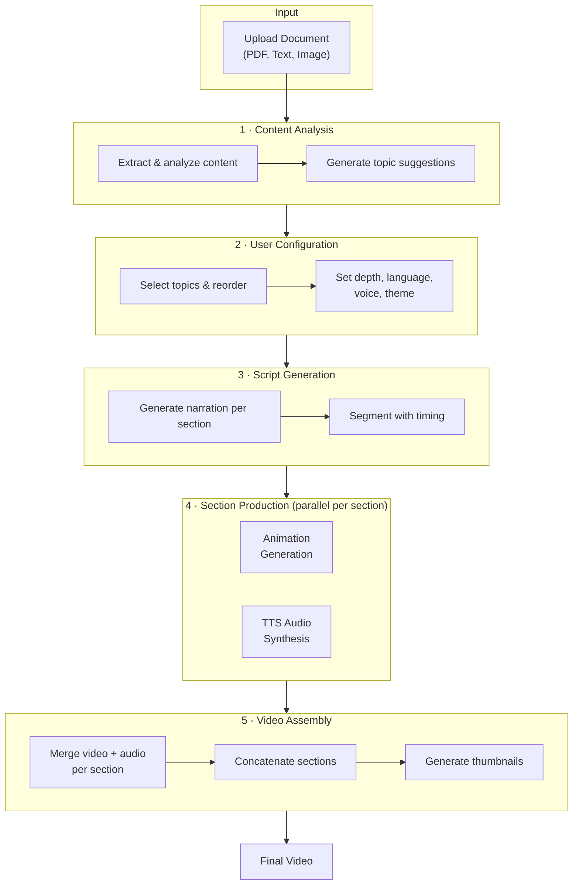
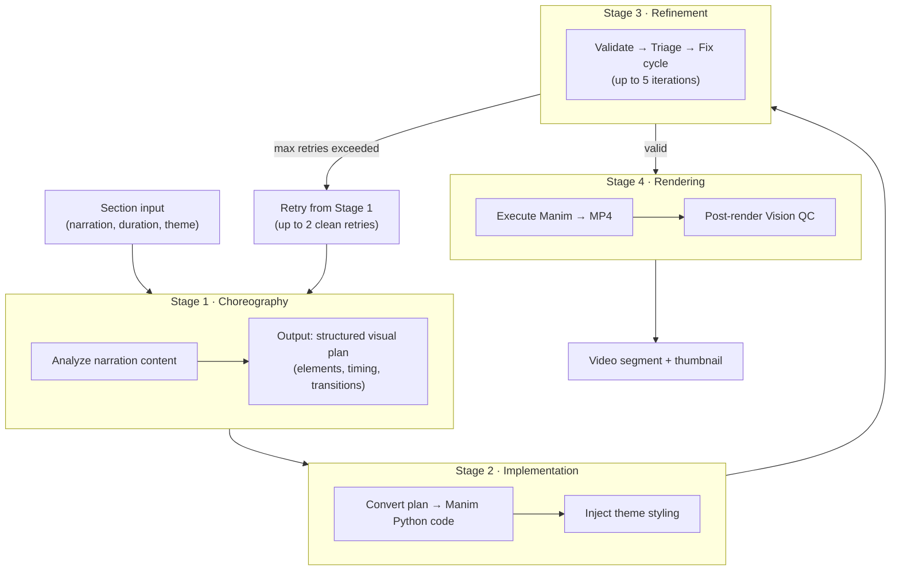
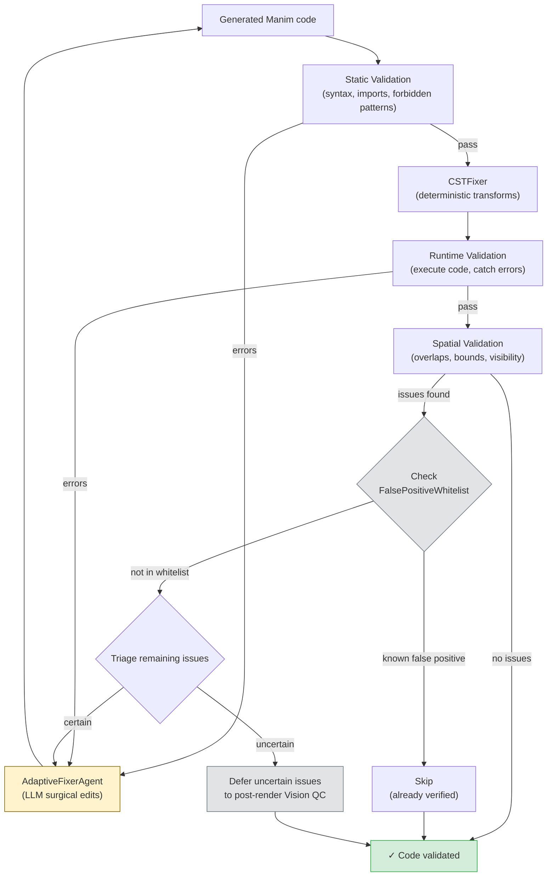
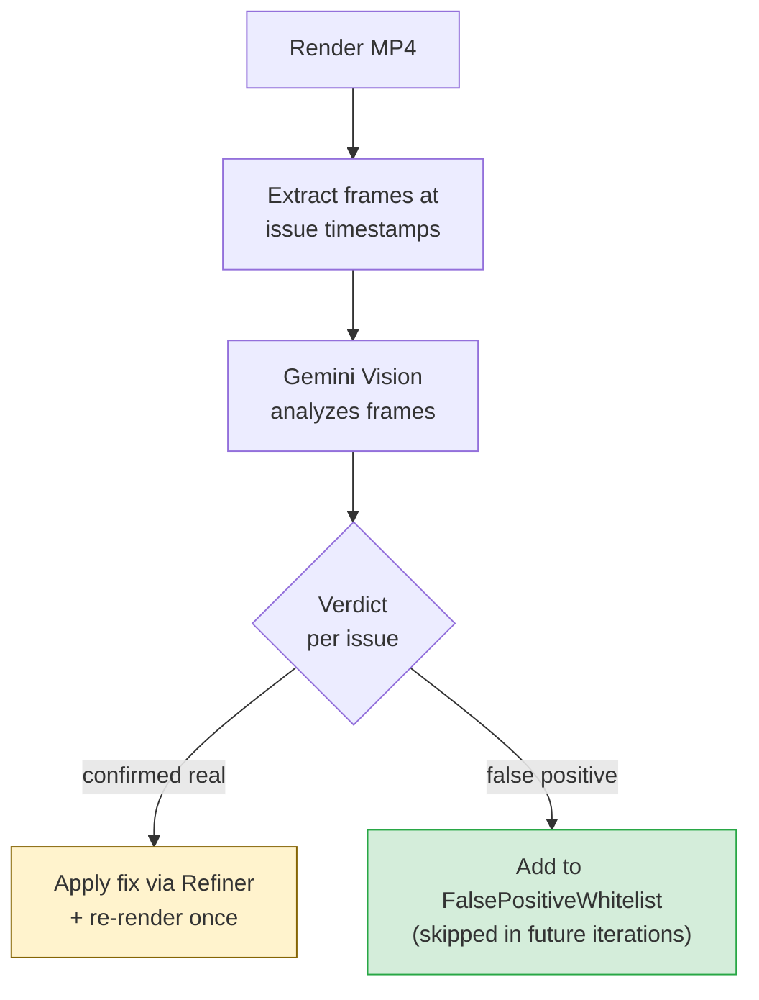

# EduViz Pipeline

Visual guide to how EduViz transforms documents into educational videos.

For setup instructions, see the [Backend README](backend/README.md) and [Frontend README](frontend/README.md).
For architecture details, see [ARCHITECTURE.md](ARCHITECTURE.md).

---

## End-to-End Flow

From document upload to final video — the complete journey through EduViz.

---

## Animation Generation Pipeline

Each section goes through a 3-stage agentic pipeline managed by `AnimationOrchestrator`, with a separate rendering step in `ManimGenerator`.

**Real class ownership:**

| Stage | Class | File |
|:---|:---|:---|
| Choreography | `Choreographer` | `stages/choreographer.py` |
| Implementation | `Implementer` | `stages/implementer.py` |
| Refinement | `Refiner` | `stages/refiner.py` |
| Orchestration | `AnimationOrchestrator` | `orchestrator.py` |
| Rendering + Vision QC | `ManimGenerator` | `generator.py` |

---

## Refinement: The Certain / Uncertain Model

The `Refiner` uses a triage model to classify validation issues as **certain** (definitely broken) or **uncertain** (might be a false positive). The `FalsePositiveWhitelist` is checked first so previously confirmed false positives are never re-evaluated.

### Post-Render Vision QC

After rendering, `ManimGenerator._run_vision_verification` resolves the deferred uncertain issues. The result feeds back into the whitelist for future iterations.

**Key components in `refinement/`:**

| Component | Responsibility |
|:---|:---|
| `CSTFixer` | Deterministic code transforms via libcst (indentation, imports, bounds clamping) |
| `AdaptiveFixerAgent` | LLM-based surgical edits with strategy selection and failure memory |
| `IssueRouter` | Classifies issues as certain vs uncertain |
| `IssueVerifier` | Sends uncertain issues to Gemini Vision for confirmation |
| `FalsePositiveWhitelist` | Tracks confirmed false positives — checked before triage to skip known non-issues |

---

## Validation Layers

Four validation layers run in sequence. Each catches a different class of errors.

| Layer | File | What it catches | How it works |
|:---|:---|:---|:---|
| **Static** | `static.py` | Syntax errors, missing imports, forbidden patterns (file I/O, subprocess, network) | AST parsing + pattern matching |
| **Runtime** | `runtime.py` | `NameError`, `AttributeError`, `ImportError`, execution crashes | Executes code in isolated subprocess |
| **Spatial** | `spatial.py` | Object overlaps, out-of-bounds elements, hidden objects, text-on-text collisions | Manim dry-run with injected spatial checks |
| **Vision** | `vision.py` | Color contrast issues, readability, visual alignment | Gemini Vision analyzes rendered screenshots |

---

## Available Themes

Themes control background color, text defaults, and accent palette. Defined in `animation/config.py`.

| Theme | Background | Text | Accents |
|:---|:---|:---|:---|
| **3Blue1Brown** (default) | `#171717` | `#FFFFFF` | `#58C4DD` `#83C167` `#FFC857` `#FF6B6B` |
| **Clean White** | `#FFFFFF` | `#111111` | `#1D4ED8` `#0F766E` `#D97706` `#DC2626` |
| **Dracula** | `#282A36` | `#F8F8F2` | `#8BE9FD` `#50FA7B` `#FFB86C` `#FF5555` |
| **Solarized Dark** | `#002B36` | `#EEE8D5` | `#268BD2` `#2AA198` `#B58900` `#DC322F` |
| **Nord** | `#2E3440` | `#ECEFF4` | `#88C0D0` `#A3BE8C` `#EBCB8B` `#BF616A` |

---

## AI Model Configuration

Models are configurable per pipeline stage via `config/models.py` and exposed through the `/pipelines` API endpoint.

| Pipeline Stage | Purpose | Default Model |
|:---|:---|:---|
| Content Analysis | Extract topics from documents | Gemini Flash |
| Script Generation | Write narration scripts | Gemini Flash |
| Choreography | Plan visual elements & timing | Gemini Flash Thinking |
| Implementation | Generate Manim code | Gemini Flash |
| Refinement | Fix validation errors | Gemini Flash |

---

## Technology Stack

| Layer | Technologies |
|:---|:---|
| **Frontend** | React 18, TypeScript, Vite, TailwindCSS, React Router, Axios |
| **Backend** | FastAPI, Python 3.12+, Uvicorn, Pydantic |
| **AI** | Google Gemini API / Vertex AI, Edge TTS (Gemini TTS experimental) |
| **Animation** | Manim, FFmpeg, libcst |
| **Infrastructure** | Docker, Nginx |
