# EduViz Pipeline: End-to-End Visual Guide

**Comprehensive visual documentation of how EduViz transforms documents into videos.**

---

## Table of Contents
- [Tech Stack Visualization](#tech-stack-visualization)
- [End-to-End User Journey](#end-to-end-user-journey)
- [Content Processing Pipeline](#content-processing-pipeline)
- [Animation Generation Deep Dive](#animation-generation-deep-dive)
- [Validation Architecture](#validation-architecture)
- [Data Flow](#data-flow)

---

## Tech Stack Visualization

---

## End-to-End User Journey

---

## Animation Generation Deep Dive

### High-Level Workflow

```mermaid
flowchart TD
    Start[Section Input]
    
    subgraph Stage1["🎭 Stage 1: Choreography"]
        Analyze[Analyze narration]
        Plan[Plan visual elements]
        Timing[Calculate timing]
        ChoreoPlan[Choreography Plan]
    end
    
    subgraph Stage2["💻 Stage 2: Implementation"]
        Generate[Generate Manim code]
        ApplyTheme[Apply theme styling]
        CodeOut[Preliminary Code]
    end
    
    subgraph Stage3["✅ Stage 3: Refinement"]
        direction TB
        Static[Static Validation]
        Runtime[Runtime Validation]
        Spatial[Spatial Validation]
        Vision[Vision QC]
        Fix[Adaptive Fixing]
        
        Static --> Runtime
        Runtime --> Spatial
        Spatial --> Vision
        Vision --> Fix
    end
    
    subgraph Stage4["🎬 Stage 4: Rendering"]
        Execute[Execute Manim]
        RenderVideo[Render MP4]
        Thumbnail[Generate Thumbnail]
    end
    
    Start --> Stage1
    Stage1 --> Stage2
    Stage2 --> Stage3
    Stage3 --> |Valid| Stage4
    Stage3 --> |Issues Found| Fix
    Fix --> Stage3
    Stage4 --> Done[✅ Video Segment]
    
    style Stage1 fill:#e1f5fe
    style Stage2 fill:#fff3e0
    style Stage3 fill:#fce4ec
    style Stage4 fill:#e8f5e9
    style Done fill:#c8e6c9
```

### Detailed Refinement Process

```mermaid
flowchart TD
    Code[Generated Code]
    
    subgraph StaticLayer["Static Validation"]
        AST[Parse AST]
        Syntax[Check Syntax]
        Imports[Verify Imports]
        Forbidden[Check Forbidden Patterns]
        Types[Type Check - Pyright]
    end
    
    subgraph RuntimeLayer["Runtime Validation"]
        Exec[Attempt Execution]
        Errors[Catch Runtime Errors]
        Undefined[Check Undefined Names]
    end
    
    subgraph SpatialLayer["Spatial Validation"]
        DryRun[Dry-run Animation]
        Overlaps[Detect Overlaps]
        Bounds[Check Boundaries]
        Visibility[Verify Visibility]
        Uncertain{Uncertain?}
    end
    
    subgraph VisionLayer["Vision QC"]
        Snapshot[Capture Screenshot]
        GeminiVision[Gemini Vision Analysis]
        RealIssue{Real Issue?}
    end
    
    subgraph FixingLayer["Adaptive Fixing"]
        Deterministic[CST Transformation]
        LLMFix[LLM Surgical Edit]
    end
    
    Code --> StaticLayer
    StaticLayer --> |Pass| RuntimeLayer
    StaticLayer --> |Fail| FixingLayer
    
    RuntimeLayer --> |Pass| SpatialLayer
    RuntimeLayer --> |Fail| FixingLayer
    
    SpatialLayer --> |Pass| Valid[✅ Valid Code]
    SpatialLayer --> Uncertain
    Uncertain --> |Yes| VisionLayer
    Uncertain --> |No, Certain Error| FixingLayer
    
    VisionLayer --> RealIssue
    RealIssue --> |Yes| FixingLayer
    RealIssue --> |No, False Positive| Whitelist[Add to Whitelist]
    Whitelist --> Valid
    
    FixingLayer --> Code
    
    style Valid fill:#c8e6c9
    style FixingLayer fill:#ffecb3
    style VisionLayer fill:#e1bee7
```

---

## Validation Architecture

### Multi-Layer Validation Stack

```mermaid
graph TD
    Input[Generated Manim Code]
    
    subgraph Layer1["Layer 1: Static Analysis"]
        L1A[Syntax Check]
        L1B[Import Verification]
        L1C[Security Patterns]
        L1D[Type Checking]
    end
    
    subgraph Layer2["Layer 2: Runtime Check"]
        L2A[Python Execution]
        L2B[Error Detection]
        L2C[Name Resolution]
    end
    
    subgraph Layer3["Layer 3: Spatial Check"]
        L3A[Manim Dry-run]
        L3B[Overlap Detection]
        L3C[Bounds Checking]
        L3D[Visibility Test]
    end
    
    subgraph Layer4["Layer 4: Vision QC"]
        L4A[Screenshot Capture]
        L4B[AI Visual Analysis]
        L4C[Issue Confirmation]
    end
    
    Input --> Layer1
    Layer1 --> |✅ Pass| Layer2
    Layer1 --> |❌ Fail| Fix1[Fix]
    
    Layer2 --> |✅ Pass| Layer3
    Layer2 --> |❌ Fail| Fix2[Fix]
    
    Layer3 --> Decision{Issues?}
    Decision --> |Certain Errors| Fix3[Fix]
    Decision --> |Uncertain| Layer4
    Decision --> |✅ No Issues| Output
    
    Layer4 --> Confirm{Confirmed?}
    Confirm --> |Real Issue| Fix4[Fix]
    Confirm --> |False Positive| Whitelist[Whitelist]
    
    Whitelist --> Output[✅ Valid Code]
    
    Fix1 --> Input
    Fix2 --> Input
    Fix3 --> Input
    Fix4 --> Input
    
    style Output fill:#c8e6c9
    style Layer1 fill:#e3f2fd
    style Layer2 fill:#fff3e0
    style Layer3 fill:#fce4ec
    style Layer4 fill:#e1bee7
```

### Validation Error Examples

---

## Data Flow

### Section Generation Data Flow

### Full Video Assembly

```mermaid
flowchart LR
    subgraph Sections["Section Generation"]
        S1[Section 1]
        S2[Section 2]
        S3[Section N]
    end
    
    subgraph Parallel["Parallel Processing"]
        direction TB
        V1[Video 1] 
        A1[Audio 1]
        V2[Video 2]
        A2[Audio 2]
        V3[Video N]
        A3[Audio N]
    end
    
    subgraph Assembly["FFmpeg Assembly"]
        Concat[Concatenate Videos]
        AudioMix[Mix Audio Tracks]
        Transitions[Add Transitions]
    end
    
    S1 --> V1 & A1
    S2 --> V2 & A2
    S3 --> V3 & A3
    
    V1 & V2 & V3 --> Concat
    A1 & A2 & A3 --> AudioMix
    
    Concat --> Assembly
    AudioMix --> Assembly
    Assembly --> Final[🎬 Final Video]
    
    style Final fill:#c8e6c9
```

---

## Configuration Options

### AI Backend Selection

### Theme Options

---

## Key Innovations

### 1. Vision-Based Validation

**Problem**: Static and runtime checks can't detect visual issues like poor color contrast or subtle overlaps.

**Solution**: Use Gemini Vision to analyze actual video screenshots for uncertain spatial issues.

### 2. Adaptive Fixing Strategy

**Deterministic First**: Use CST transformations for common patterns (fast, reliable)
**LLM Fallback**: Use Gemini for complex issues requiring understanding (smart, flexible)

```mermaid
graph TD
    Issue[Validation Issue]
    
    Pattern{Known Pattern?}
    Issue --> Pattern
    
    Pattern --> |Yes| CST[CST Transformation]
    Pattern --> |No| LLM[LLM Surgical Edit]
    
    CST --> Fast[⚡ Fast Fix]
    LLM --> Smart[🧠 Smart Fix]
    
    Fast --> Validate
    Smart --> Validate
    
    Validate{Fixed?}
    Validate --> |Yes| Done[✅ Complete]
    Validate --> |No, Retry| Pattern
    
    style CST fill:#c8e6c9
    style LLM fill:#fff9c4
    style Done fill:#a5d6a7
```

### 3. Incremental Refinement

Instead of regenerating entire animations, apply surgical fixes and re-validate.

```mermaid
flowchart LR
    Code[Original Code]
    Issue[Issue Detected]
    
    Code --> Issue
    Issue --> Surgical[Apply Surgical Edit]
    Surgical --> Revalidate[Re-validate]
    
    Revalidate --> |✅ Fixed| Done[Complete]
    Revalidate --> |❌ Still Broken| NextFix[Try Next Fix]
    NextFix --> Surgical
    
    Revalidate --> |Max Attempts| Regenerate[Full Regenerate]
    
    style Surgical fill:#fff9c4
    style Done fill:#c8e6c9
    style Regenerate fill:#ffcdd2
```

---

## Performance Metrics

### Pipeline Timing (Typical Section)

### Cost Distribution (Typical Video)

---

## Summary

EduViz is a production-grade AI pipeline that:

1. ✅ **Analyzes** educational content using Gemini AI
2. ✅ **Generates** narration scripts with timing
3. ✅ **Synthesizes** audio using Gemini TTS
4. ✅ **Creates** Manim animations through multi-stage AI pipeline
5. ✅ **Validates** code through 4 layers (Static → Runtime → Spatial → Vision)
6. ✅ **Fixes** issues adaptively (CST + LLM)
7. ✅ **Renders** professional videos with FFmpeg
8. ✅ **Assembles** final videos with synchronized audio

**Result**: High-quality educational videos, fully automated, from any document.
